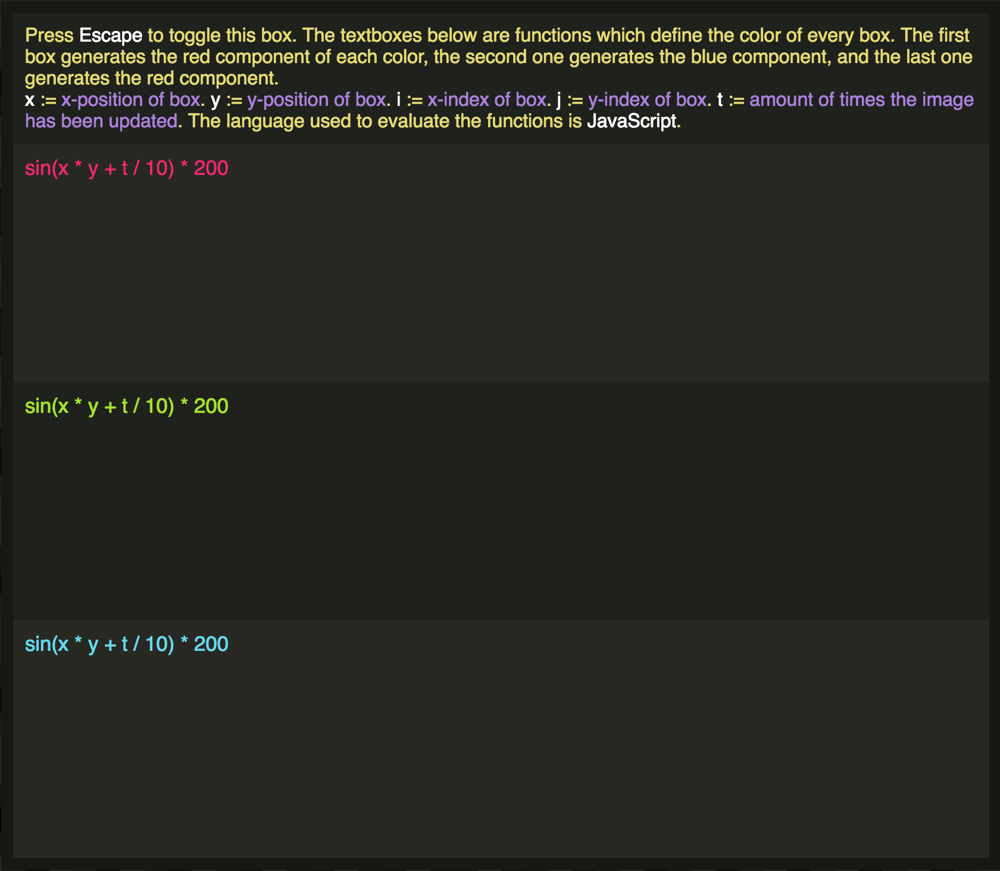

## Math Canvas

### Summary
Math canvas is a little tool that allows you to create art using simple math equations. The basic idea is that you provide a function for the color of each square on the page, given the square's position, and time. Here's a list of variables that you have access to in the editor:

| variable | definition|
|---|---|
|  `x` |  The literal x-coordinate of the square |
|  `y` |  The literal y-coordinate of the square |
|  `i` | The number of the square horizontaly (10th square from the left => `i = 10`)  |\
| `j` | Same as `i` but vertically |
| `t` | The amount of 'ticks' of the clock that have occured since the page loaded |

Here's an example of how you would write equations in the editor. How it works under the hood is that the equations are `eval`ed as bodies of functions with `x`, `y`, `i`, `j`, and `t` as function parameters. So, anything that would be valid JavaScript should be fine to use. Common math functions are aliased for brevity: `Math.sin(...)` can also be written as `sin(...)`. For a complete list of aliases, you can view this line of the source: [https://github.com/ichub/math-canvas/blob/master/main.js#L60](https://github.com/ichub/math-canvas/blob/master/main.js#L60).

